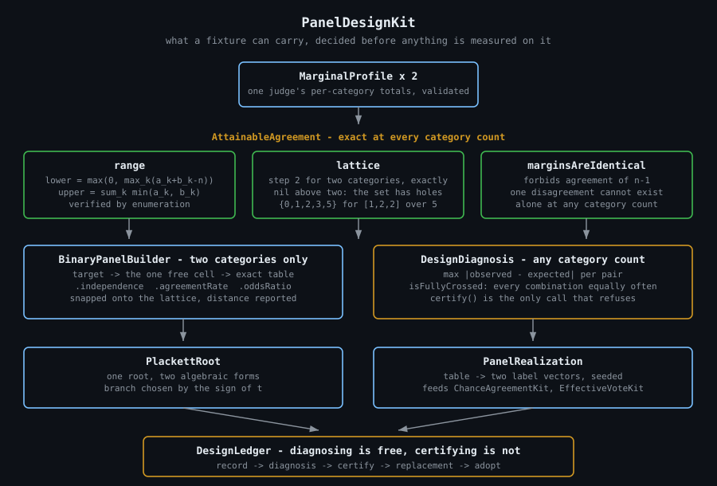
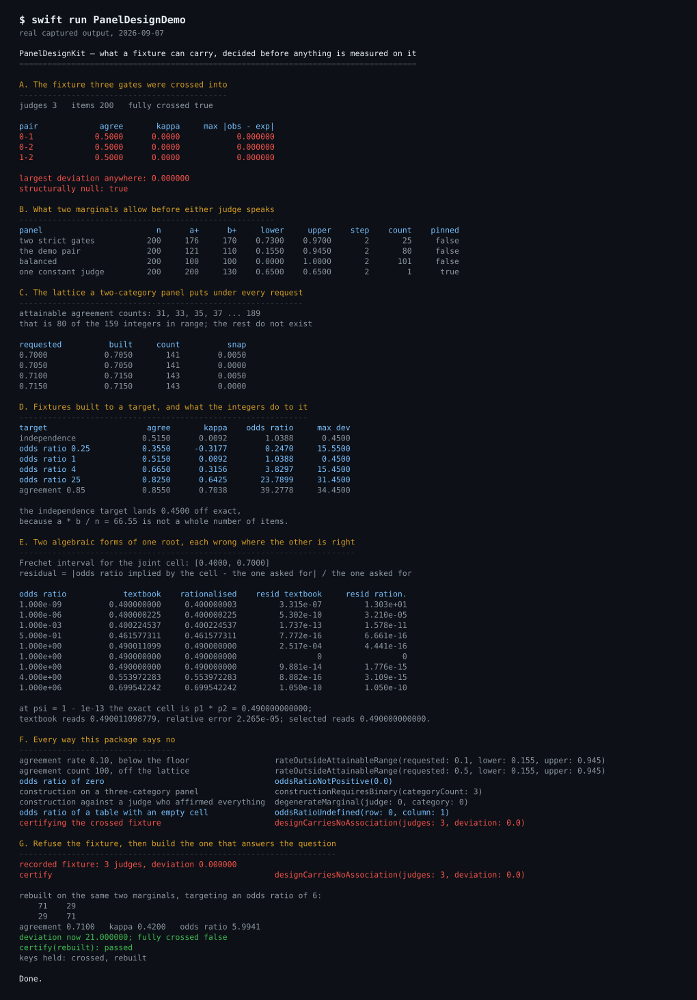
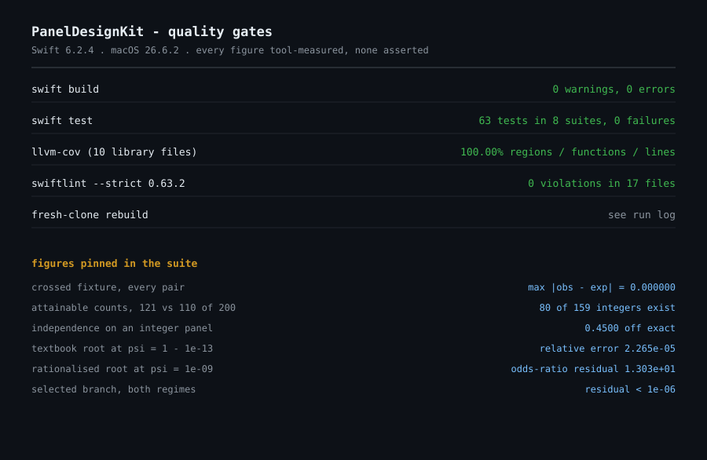

# PanelDesignKit

Every coefficient an LLM-judge pipeline publishes is computed over a **fixture** — a panel of
items, labelled by two or more judges. The fixture is the one input nobody checks. Build it the
natural way, by crossing every factor with every other, and its pairwise association is not small
but **exactly zero**, so the agreement statistic, its confidence interval and its multiplicity
correction are all estimating a quantity whose true value is nil.

This package prices what a fixture can carry before anything is measured on it, refuses to certify
one that can carry nothing, and builds the replacement.

Swift 6, actor-isolated, `Sendable` value types, no dependencies. Built to sit beside
[`ProviderGatewayKit`](https://github.com/rajatslakhina/foundation-model-provider-gateway) in an
LLM-judge evaluation pipeline, and to feed label vectors straight into
[`ChanceAgreementKit`](https://github.com/rajatslakhina/chance-agreement-kit) and
[`EffectiveVoteKit`](https://github.com/rajatslakhina/effective-vote-kit).



---

## The problem

Three claims get made about a fixture, and all three are usually made by accident.

**"The judges agree on 30% of items."** Two marginals decide which agreement rates exist, and the
floor is not zero. Two strict gates that each affirm 176 of 200 items must agree on at least
**146** of them — 73% — whatever either of them knows. The shortfall belongs to the design. Asked
for a panel at 30%, this package names the interval rather than returning the nearest thing.

**"The judges agree on 70.0% of items."** On a two-category panel with fixed margins there is
exactly one free cell, and moving it by one item moves *both* diagonal cells. So the agreement
count steps by **two**, and only 80 of the 159 integers between the floor and the ceiling exist at
all. A caption reading 0.700 on a panel whose nearest attainable rate is 0.705 is off by a whole
item.

**"The judges are independent in the control condition."** A fully crossed factorial is exactly
independent, which sounds like the goal and is the failure: there is nothing for a coefficient to
find. Meanwhile an *integer* panel usually cannot be exactly independent at all, because
`a * b / n` is rarely a whole number of items — 121 and 110 over 200 predicts 66.55 both-positives
and the panel has to pick 67.

## What this package does

```swift
import PanelDesignKit

let ledger = DesignLedger()
await ledger.record("control", panel: crossedFixture)      // 3 gates, 200 items

try await ledger.diagnosis(for: "control")                 // always available
//   maximumPairDeviation  0.000000
//   isFullyCrossed        true
//   isStructurallyNull    true

try await ledger.certify("control")
//   throws .designCarriesNoAssociation(judges: 3, deviation: 0.0)

let rebuilt = try await ledger.replacement(
    for: "control", pair: (0, 1), target: .oddsRatio(6), seed: 20_260_907
)
//   same two marginals, 71/29/29/71, agreement 0.7100, kappa 0.4200, odds ratio 5.9941
try await ledger.adopt("rebuilt", construction: rebuilt, seed: 20_260_907)
try await ledger.certify("rebuilt")                        // passes
```

Diagnosing a fixture is arithmetic and always available. **Certifying** one — putting a coefficient
on a page and letting a reader take it as a statement about the judges — is a claim that the panel
had association in it to find, and `certify` is the only call here that can refuse.

### What two marginals allow, before either judge speaks

| panel | n | a+ | b+ | floor | ceiling | step | counts that exist |
|---|---|---|---|---|---|---|---|
| two strict gates | 200 | 176 | 170 | 0.7300 | 0.9700 | 2 | 25 |
| the demo pair | 200 | 121 | 110 | 0.1550 | 0.9450 | 2 | 80 |
| balanced | 200 | 100 | 100 | 0.0000 | 1.0000 | 2 | 101 |
| one constant judge | 200 | 200 | 130 | 0.6500 | 0.6500 | 2 | **1** |

The last row is the sharpest reading the type produces. A judge who affirmed every item **pins**
the agreement rate: it is not a property of the pair, it is the other judge's marginal restated.

Both bounds are closed-form, and both are checked against exhaustive enumeration of every integer
table the margins admit, for two, three and four categories.

### Two results the package found on its own

**Above two categories there is no lattice, and the counterexample is small.** Five items, three
categories, identical margins `[1, 2, 2]`: the attainable agreement counts are `{0, 1, 2, 3, 5}`.
Contiguous, and then a hole immediately below the maximum. So `step` is `2` for two categories and
`nil` above two, and `admits(count:)` returns `nil` rather than guessing — `false` stays reserved
for counts that are genuinely impossible.

**The hole generalises, and it is provable.** If the two margins are *identical*, the label vectors
are the same multiset, so a single disagreement cannot exist alone: the item that left a category
leaves it one short and something has to move in. **An agreement count of `n - 1` is unattainable
for identical margins at every category count** — the general form of the two-category step, and
the reason four is missing above. Checked against enumeration for every margin over six items at
two and three categories, and five items at four.

### One root, two algebraic forms, and neither is the right one

Plackett's construction gives the joint cell from the margins and an odds ratio by solving a
quadratic. The form printed in the literature, `(t - s) / (2(psi - 1))`, needs a special case at
`psi == 1` and loses precision near it. Rationalising the numerator gives `2 psi p1 p2 / (t + s)`,
which is continuous at one and evaluates to `p1 * p2` there with no special case — and which
cancels catastrophically in the other direction.

| odds ratio | textbook cell | rationalised cell | residual, textbook | residual, rationalised |
|---|---|---|---|---|
| 1e-09 | 0.400000000 | 0.400000003 | 3.315e-07 | **1.303e+01** |
| 1e-06 | 0.400000225 | 0.400000225 | 5.302e-10 | 3.210e-05 |
| 0.5 | 0.461577311 | 0.461577311 | 7.772e-16 | 6.661e-16 |
| 1 - 1e-13 | 0.490011099 | 0.490000000 | **2.517e-04** | 4.441e-16 |
| 4 | 0.553972283 | 0.553972283 | 8.882e-16 | 3.109e-15 |

The residual is the odds ratio the returned cell *implies*, against the one that was asked for — a
self-check that needs no reference value. **One comparison covers the whole domain**: the sign of
`t = 1 + (p1 + p2)(psi - 1)`. Where `t` is non-negative, `t + s` adds two non-negative quantities
and the rationalised form is clean. Where `t` is negative, `s` is positive, `t - s` subtracts
nothing, and `t < 0` forces `psi < 1` so the textbook denominator is safely away from zero.
`jointProbability` picks; `evaluate(_:)` exposes both, because the comparison is the point.

### Construction is two categories only, and that is a boundary rather than a gap

With two categories the margins leave one free cell, so a target picks the table outright and
correctness is arithmetic. Above two, the same question is a transportation problem with a
forbidden diagonal and a prescribed trace. `AttainableAgreement` prices that problem exactly at
every category count; `BinaryPanelBuilder` declines to solve it and says so.

### Refusals

| refusal | when |
|---|---|
| `designCarriesNoAssociation` | certifying a fixture whose pairs are exactly independent |
| `rateOutsideAttainableRange` | a target below the floor, above the ceiling, or off the lattice |
| `latticeRequiresBinary` | snapping a rate on a panel whose attainable set has holes |
| `constructionRequiresBinary` | building above two categories |
| `degenerateMarginal` | building against a judge with no variance |
| `oddsRatioNotPositive` | a target no joint distribution has |
| `oddsRatioUndefined` | reading an odds ratio off a table with an empty cell |

An empty cell is not an infinite association. It is an association the table has no information
about, and the two read very differently on a page.

## Install

```swift
.package(url: "https://github.com/rajatslakhina/panel-design-kit.git", from: "1.0.0")
```

## Demo

```
swift run PanelDesignDemo
```



## Gates



`swift build` 0 warnings, 0 errors. **63 tests in 8 suites, 0 failures.** `llvm-cov`
**100.00% on regions, functions and lines across all 10 library files** — the only file in the
report below 100% is swift-testing's own generated `runner.swift`, which is not package code.
`swiftlint --strict` (0.63.2, real binary) **0 violations in 17 files**.

## Licence

MIT.
